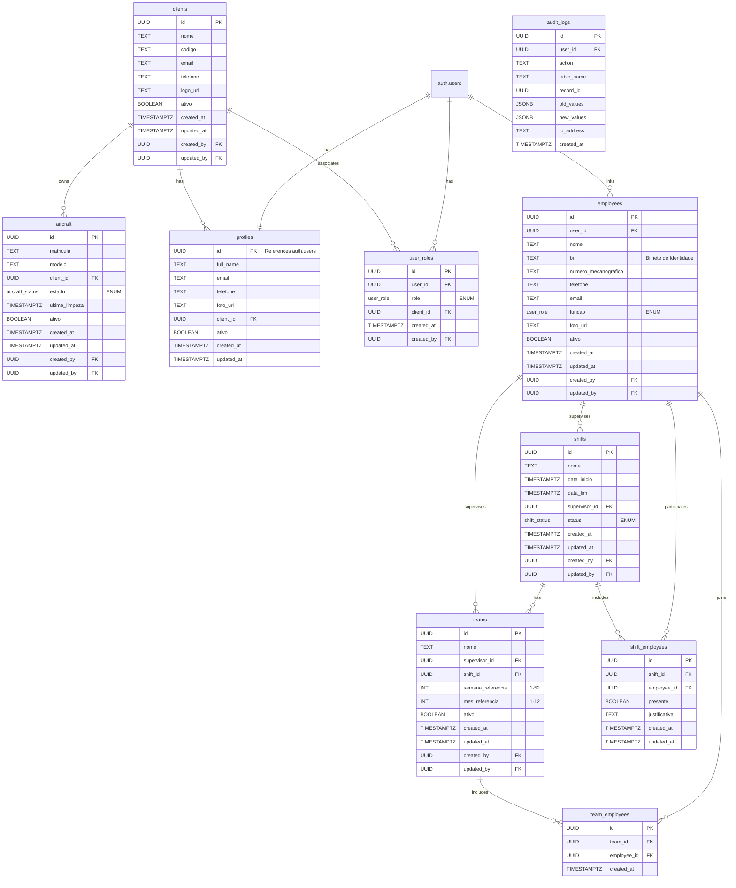

# Database Schema Documentation

## Entity Relationship Diagram

## Enums

### user_role
- super_admin
- gestor
- supervisor
- tecnico
- auxiliar
- cliente

### aircraft_status
- ativo
- em_manutencao
- inativo

### shift_status
- ativo
- encerrado

## Row Level Security (RLS) Policies

### Clients
- View: All authenticated users
- Insert/Update: Admins and managers only
- Delete: Admins only

### Profiles
- View: All authenticated users
- Update: Own profile only

### User Roles
- View: All authenticated users
- Manage: Super admins only

### Employees
- View: AirPlus staff (admin, manager, supervisor) and self
- Insert/Update: Admins and managers only
- Delete: Admins only

### Aircraft
- View: Owner client and AirPlus staff
- Insert/Update: Admins and managers only
- Delete: Admins only

### Shifts
- View: AirPlus staff
- Insert: Admins and managers only
- Update: Managers and supervisors
- Delete: Admins only

### Teams
- View: AirPlus staff
- Manage: Admins and managers only

### Shift Employees
- View: AirPlus staff
- Manage: Supervisors and above

### Team Employees
- View: AirPlus staff
- Manage: Admins and managers only

### Audit Logs
- View: Admins only

## Special Functions

### Triggers
1. `update_updated_at_column()`
   - Updates `updated_at` timestamp on record changes
   - Applied to: clients, profiles, employees, aircraft, shifts, teams

2. `handle_new_user()`
   - Auto-creates profile when new auth.user is created
   - Sets initial profile data from auth metadata

3. `auto_assign_super_admin()`
   - Assigns super_admin role to first user in system
   - Ensures system always has at least one admin

### Helper Functions
1. `has_role(user_id UUID, role user_role)`
   - Checks if user has specific role

2. `is_admin_or_manager(user_id UUID)`
   - Checks if user is super_admin or gestor

## Indices
- aircraft: client_id, matricula
- employees: numero_mecanografico, email
- shifts: data_inicio, data_fim
- user_roles: user_id, role
- audit_logs: user_id, table_name

## Data Protection
- All tables have RLS enabled
- Audit logging for all critical operations
- Multi-tenant isolation via client_id
- Role-based access control
- Automatic timestamps and user tracking