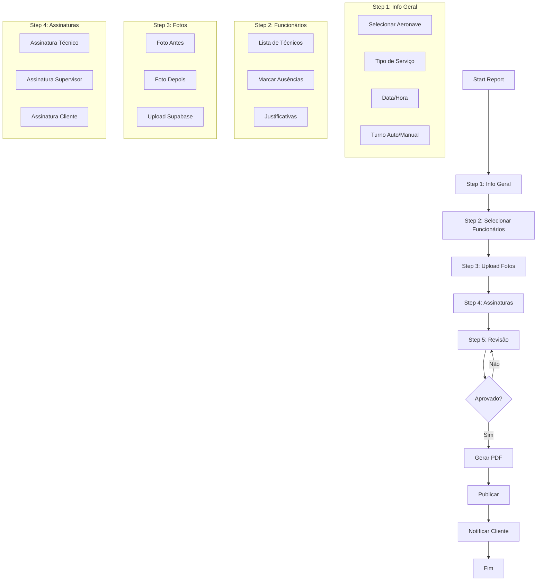
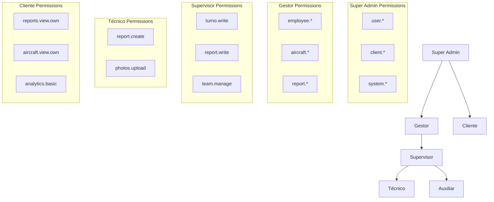
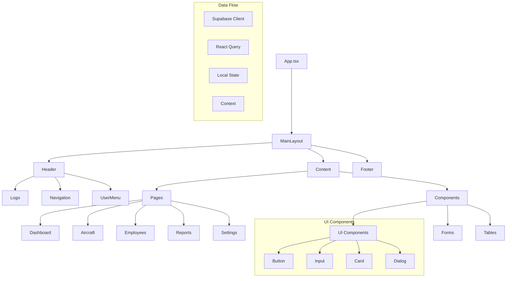
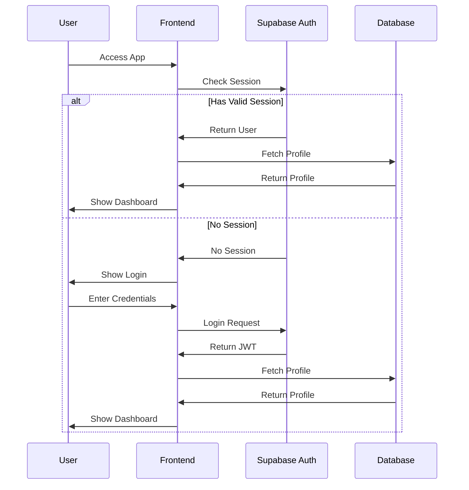
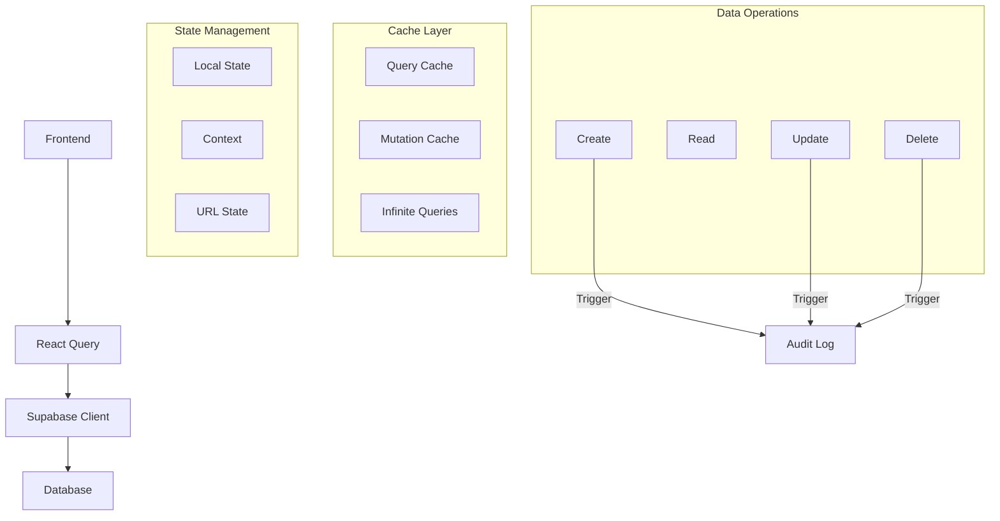
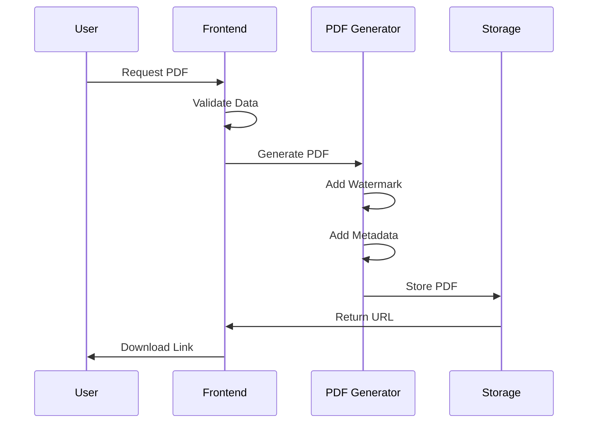

# System Workflows

## 1. Report Creation Flow

## 2. Role Hierarchy and Permissions

## 3. Frontend Component Structure

## 4. Authentication Flow

## 5. Data Flow and State Management

## 6. PDF Generation Workflow

