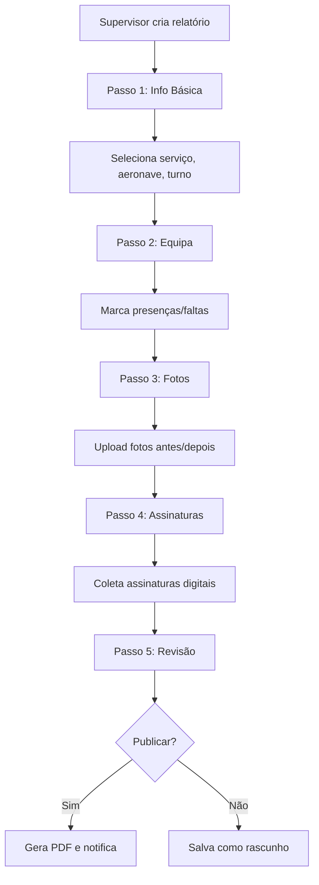
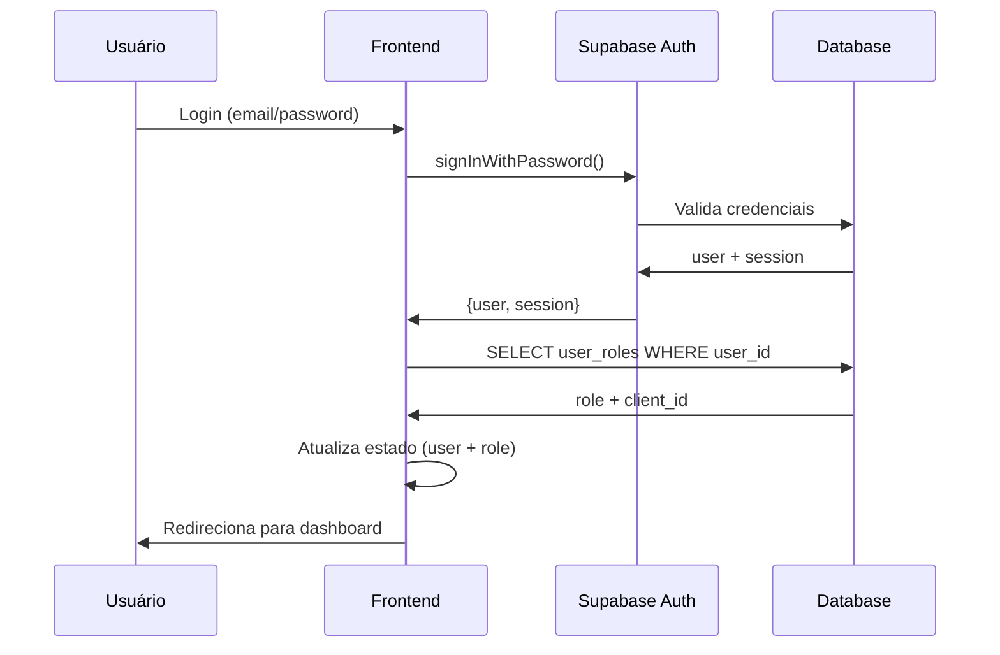

# Visão Geral do Sistema - AirPlus AAMS

## Identificação do Sistema

**Nome**: AirPlus Aircraft Activity Management System (AAMS)  
**Versão**: 1.0.0  
**Cliente**: AirPlus Services Angola  
**NIF**: 5403048827  
**Sede**: Miramar, Luanda, Angola  
**Operações**: Aeroporto Dr. Agostinho Neto, Bela Vista, KM 44  
**Contacto**: +244 933001002 | info@airplus.services  
**Website**: https://www.airplus.services

## Descrição do Sistema

O AirPlus AAMS é um sistema especializado de gestão de atividades aeronáuticas, focado em:

- **Limpeza de Aeronaves** (exterior, interior e completa)
- **Serviços de Rampa** (embarque, desembarque, assistência em terra)
- **Gestão Operacional** (turnos, equipas, relatórios)
- **Dashboards e KPIs** (para AirPlus e clientes)
- **Auditoria e Segurança** (logs, RLS, RBAC)

## Arquitetura Tecnológica

### Frontend
- **Framework**: React 18.3.1 + TypeScript
- **Build Tool**: Vite
- **Estilização**: Tailwind CSS + shadcn/ui
- **State Management**: TanStack Query (React Query)
- **Roteamento**: React Router DOM v6
- **Formulários**: React Hook Form + Zod
- **Gráficos**: Recharts
- **PDF**: jsPDF + jsPDF AutoTable
- **Excel**: XLSX

### Backend (Supabase)
- **Base de Dados**: PostgreSQL 15+
- **Autenticação**: Supabase Auth (email/password)
- **Storage**: Supabase Storage (fotos, assinaturas, logos)
- **Real-time**: Supabase Realtime (opcional)
- **Edge Functions**: Deno (futuro)

### Segurança
- **RLS**: Row Level Security em todas as tabelas críticas
- **RBAC**: Role-Based Access Control (5 níveis)
- **Auditoria**: Logs automáticos de todas as operações
- **Validação**: Zod schemas em frontend + constraints DB
- **HTTPS**: Obrigatório em produção

## Modelo de Negócio

### Multi-Tenant com Gestão Única

**AirPlus (Admin)** é a única entidade com permissões de escrita e gestão completa.

**Clientes** têm acesso **read-only** aos seus próprios dados via dashboards personalizados.

### Hierarquia de Utilizadores

1. **Super Admin** (AirPlus HQ)
   - Acesso total ao sistema
   - Gestão de clientes, utilizadores, configurações
   - Auditoria e segurança

2. **Gestor** (AirPlus Management)
   - Gestão operacional (turnos, equipas, relatórios)
   - Análise de KPIs
   - Gestão de serviços

3. **Supervisor** (AirPlus Field)
   - Criação e edição de relatórios
   - Gestão de equipas e presenças
   - Execução de turnos

4. **Técnico/Assistente** (AirPlus Operacional)
   - Visualização de turnos atribuídos
   - Marcação de presenças
   - Read-only em relatórios

5. **Cliente** (External)
   - Dashboard personalizado
   - Visualização de relatórios dos seus aviões
   - Exportação de dados
   - **Sem permissões de escrita**

## Módulos Principais

### 1. Estrutura Corporativa
- Companies (AirPlus)
- Departments (Operações, RH, Comercial, Admin, TI)
- Services (9 serviços oficiais)

### 2. Clientes e Aeronaves
- Cadastro de clientes externos
- Gestão de aeronaves (matrícula, modelo, estado)
- Histórico de limpezas

### 3. Recursos Humanos
- Employees (nome, BI, foto, função)
- Teams (equipas por turno/semana)
- Shift Templates (modelos de turnos reutilizáveis)

### 4. Operações
- Shifts (turnos com data/hora, supervisor, equipa)
- Shift Employees (presenças e justificações)
- Shift Reports (relatório final do turno)

### 5. Relatórios de Serviço
Workflow em 5 etapas:
1. **Informações Básicas** (tipo serviço, aeronave, turno, observações)
2. **Equipa** (funcionários presentes/ausentes)
3. **Fotos** (antes/depois, mínimo 1 cada)
4. **Assinaturas** (supervisor, cliente, mínimo 2)
5. **Revisão e Publicação** (PDF final)

### 6. Dashboards
- **AirPlus Dashboard**: KPIs operacionais completos
- **Client Dashboard**: Dados filtrados por cliente

### 7. Configurações
- Service Types (tipos de serviço e checklists)
- System Config (idioma, timezone, versão)
- Client Config (branding, preferências)
- Report Config (campos visíveis/obrigatórios)
- Role Matrix (permissões por role)

### 8. Auditoria
- Audit Logs (user_id, ação, tabela, valores antigos/novos)
- Histórico completo de alterações
- Rastreabilidade total

## Fluxos de Trabalho Principais

### Fluxo de Criação de Relatório



### Fluxo de Autenticação



## Regras de Negócio Críticas

1. **Imutabilidade de Relatórios Publicados**
   - Uma vez publicado (status='publicado'), o relatório não pode ser editado
   - Apenas visualização e exportação PDF

2. **Validação de Fotos**
   - Mínimo 1 foto "antes" e 1 foto "depois"
   - Máximo configurável por tipo de serviço

3. **Validação de Assinaturas**
   - Mínimo 2 assinaturas (normalmente supervisor + cliente)
   - Assinatura digital obrigatória

4. **Soft Delete**
   - Nenhuma exclusão física de dados críticos
   - Campo `ativo=false` para desativação

5. **Auditoria Automática**
   - Todas as operações INSERT/UPDATE/DELETE geram logs
   - Campos `created_by`, `updated_by`, `created_at`, `updated_at` obrigatórios

6. **Isolamento de Dados (RLS)**
   - Clientes veem apenas seus aviões e relatórios
   - Técnicos veem apenas seus turnos
   - Supervisores/Gestores/Admins veem tudo (AirPlus)

## Padrões e Convenções

### Nomenclatura de Tabelas
- Singular em inglês: `aircraft`, `employee`, `shift`
- Tabelas de relação: `shift_employees`, `team_employees`
- Tabelas de configuração: `*_configs`

### Nomenclatura de Campos
- Português para campos de domínio: `matricula`, `nome`, `observacoes`
- Inglês para campos técnicos: `id`, `created_at`, `updated_at`
- UUIDs para todas as chaves primárias

### Formato de Datas
- Armazenamento: `timestamp with time zone` (UTC)
- Exibição: `dd/MM/yyyy HH:mm` (timezone Angola)
- Locale: `pt-BR` (português brasileiro como fallback)

### Formato de Telefone (Angola)
- Internacional: `+244 9XX XXX XXX`
- Validação: `/^(\+244|00244)?[9][1-9][0-9]{7}$/`

### Formato de BI (Angola)
- Padrão: `000000000XX00` (11-14 caracteres alfanuméricos)

## Requisitos Não Funcionais

### Performance
- Tempo de carregamento inicial: < 3s
- Time to Interactive: < 5s
- Queries otimizadas com índices

### Disponibilidade
- Uptime target: 99.5%
- Backups diários automáticos (Supabase)
- CDN global (Netlify/Vercel)

### Segurança
- HTTPS obrigatório
- Autenticação JWT (Supabase)
- RLS ativo em todas as tabelas
- Validação client-side + server-side
- Sem exposição de secrets (variáveis ambiente)

### Usabilidade
- Mobile-first responsive
- Dark mode support
- Feedback imediato (toasts, loading states)
- Validação em tempo real
- Mensagens de erro amigáveis

### Escalabilidade
- Arquitetura serverless (Supabase)
- Query caching (React Query)
- Lazy loading de imagens
- Paginação em listas grandes

## Dependências Principais

```json
{
  "@supabase/supabase-js": "^2.76.0",
  "@tanstack/react-query": "^5.83.0",
  "react": "^18.3.1",
  "react-hook-form": "^7.61.1",
  "zod": "^3.25.76",
  "tailwindcss": "^3.x",
  "jspdf": "^3.0.3",
  "xlsx": "^0.18.5",
  "recharts": "^2.15.4"
}
```

## Ambiente de Desenvolvimento

### Configuração Inicial
```bash
npm install
npm run dev
```

### Variáveis de Ambiente (.env)
```
VITE_SUPABASE_URL=https://mwyvxnwweagcfkgmmdmt.supabase.co
VITE_SUPABASE_ANON_KEY=eyJhbGc...
```

### Estrutura de Pastas
```
src/
├── components/       # Componentes React
│   ├── ui/          # shadcn/ui components
│   ├── layout/      # Layout components
│   ├── reports/     # Report-specific components
│   ├── shifts/      # Shift-specific components
│   └── ...
├── hooks/           # Custom hooks
│   └── queries/     # React Query hooks
├── pages/           # Route pages
├── lib/             # Utilities
│   ├── validations/ # Zod schemas
│   └── utils/       # Helper functions
├── types/           # TypeScript types
└── integrations/    # External integrations
    └── supabase/    # Supabase client + types
```

## Considerações para Angola

- **Idioma**: Português (pt-BR como fallback)
- **Timezone**: `Africa/Luanda` (GMT+1, sem DST)
- **Moeda**: Kwanza (AOA) - símbolo `Kz`
- **Formato de Telefone**: `+244 9XX XXX XXX`
- **Formato de Data**: `dd/MM/yyyy`
- **Documento de Identificação**: BI (Bilhete de Identidade)

## Próximas Fases

### Fase 2 (Futuro)
- Notificações em tempo real (Supabase Realtime)
- Modo offline (PWA + Service Workers)
- App mobile nativo (React Native)
- Integração com APIs externas (meteorologia, voos)

### Fase 3 (Futuro)
- BI Avançado (Power BI / Metabase)
- Machine Learning (previsão de demanda)
- Chatbot de suporte (Lovable AI)
- API pública para clientes

---

**Última Atualização**: 2025-10-22  
**Responsável**: Equipe AirPlus TI  
**Versão do Documento**: 1.0
