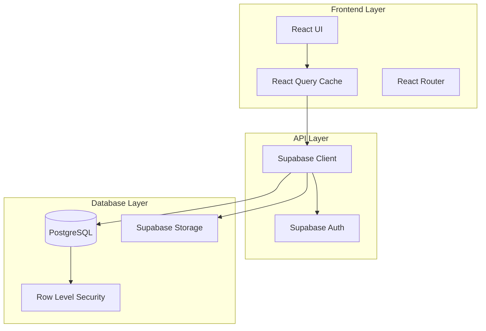
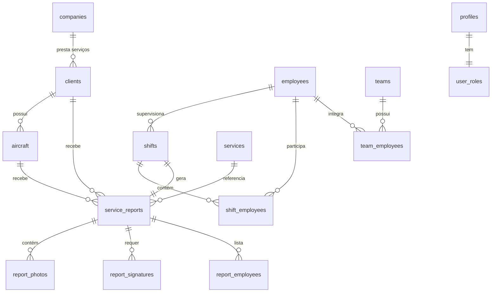
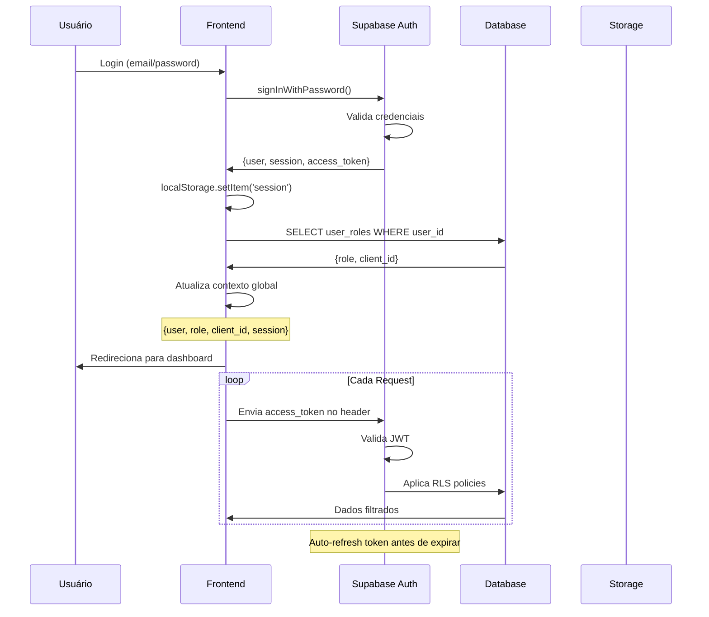

# Arquitetura Técnica - AirPlus AAMS

## Visão Geral da Arquitetura

O AirPlus AAMS segue uma arquitetura moderna de três camadas com separação clara de responsabilidades:



## Stack Tecnológica Detalhada

### Frontend

#### Framework Base
- **React 18.3.1**: Framework UI com Hooks e Concurrent Mode
- **TypeScript 5.x**: Tipagem estática para maior segurança
- **Vite**: Build tool ultrarrápido com HMR
- **React Router DOM v6**: Roteamento declarativo

#### UI e Estilização
- **Tailwind CSS 3.x**: Utility-first CSS framework
- **shadcn/ui**: Componentes acessíveis e customizáveis
- **Radix UI**: Primitivos acessíveis (base do shadcn)
- **next-themes**: Suporte a dark/light mode
- **lucide-react**: Ícones SVG otimizados

#### Gestão de Estado
- **TanStack Query v5**: Server state management
  - Cache automático
  - Revalidação em background
  - Optimistic updates
  - Infinite queries
- **React Hook Form**: Gestão de formulários performática
- **Zustand** (futuro): Client state management se necessário

#### Validação e Formulários
- **Zod**: Schema validation runtime
- **@hookform/resolvers**: Integração RHF + Zod
- **Input Masks**: react-input-mask para telefone, BI, etc.

#### Visualização de Dados
- **Recharts**: Gráficos responsivos e customizáveis
- **@tanstack/react-table**: Tabelas avançadas com sorting/filtering
- **jsPDF**: Geração de PDFs client-side
- **jspdf-autotable**: Tabelas em PDF
- **xlsx**: Exportação para Excel

#### Upload e Media
- **react-dropzone**: Drag & drop de arquivos
- **react-signature-canvas**: Assinaturas digitais
- **Image optimization**: Lazy loading + responsive images

### Backend (Supabase)

#### Base de Dados
- **PostgreSQL 15+**: RDBMS open-source
- **Extensions**:
  - `uuid-ossp`: Geração de UUIDs
  - `pg_cron`: Jobs agendados (futuro)
  - `postgis`: Geolocalização (futuro)

#### Autenticação
- **Supabase Auth**: Sistema completo de autenticação
  - Email/Password
  - Magic Links (futuro)
  - OAuth providers (futuro)
  - JWT tokens
  - Refresh tokens automáticos

#### Storage
- **Supabase Storage**: Object storage S3-compatible
  - Buckets: `avatars`, `logos`, `photos`, `signatures`, `reports`
  - Transformações de imagem on-the-fly
  - Políticas de acesso por RLS

#### Real-time (Futuro)
- **Supabase Realtime**: WebSocket para atualizações live
  - Notificações de novos relatórios
  - Status de turnos em tempo real
  - Presença de utilizadores

#### Edge Functions (Futuro)
- **Deno Runtime**: Serverless functions
  - Processamento de imagens
  - Envio de emails/SMS
  - Integração com APIs externas
  - Webhooks

### DevOps e Infraestrutura

#### CI/CD
- **GitHub Actions**: Automação de deploy
- **ESLint + Prettier**: Linting e formatação
- **TypeScript Compiler**: Verificação de tipos
- **Vitest** (futuro): Testes unitários

#### Hosting
- **Netlify/Vercel**: Frontend hosting
  - CDN global
  - HTTPS automático
  - Preview deploys
  - Edge caching
- **Supabase Cloud**: Backend hosting
  - Multi-region
  - Backups automáticos
  - Monitoring integrado

#### Monitorização
- **Supabase Logs**: Logs de queries e auth
- **Sentry** (futuro): Error tracking
- **Google Analytics** (futuro): User analytics

## Arquitetura de Dados

### Modelo Entidade-Relacionamento



### Principais Entidades

#### 1. Companies (AirPlus)
```typescript
interface Company {
  id: uuid;
  nome: string;              // "AirPlus Services Angola"
  nif: string;               // "5403048827"
  morada_sede: string;
  morada_operacoes: string;
  telefone_principal: string;
  email: string;
  website: string;
  ativo: boolean;
  created_at: timestamp;
  updated_at: timestamp;
}
```

#### 2. Departments
```typescript
interface Department {
  id: uuid;
  nome: string;              // "Operações", "RH", etc.
  descricao: string;
  created_at: timestamp;
  updated_at: timestamp;
}
```

#### 3. Services
```typescript
interface Service {
  id: uuid;
  nome: string;              // "Limpeza Exterior"
  codigo: string;            // "limpeza_exterior"
  categoria: 'limpeza' | 'rampa' | 'gestão' | 'manutenção' | 'formação';
  descricao: text;
  ativo: boolean;
  created_at: timestamp;
  updated_at: timestamp;
}
```

#### 4. Clients
```typescript
interface Client {
  id: uuid;
  codigo: string;            // Código único
  nome: string;
  email: string;
  telefone: string;
  logo_url: string;
  ativo: boolean;
  created_by: uuid;
  updated_by: uuid;
  created_at: timestamp;
  updated_at: timestamp;
}
```

#### 5. Aircraft
```typescript
interface Aircraft {
  id: uuid;
  client_id: uuid;           // FK -> clients
  matricula: string;         // Matrícula única
  modelo: string;
  estado: 'ativo' | 'manutencao' | 'inativo';
  ultima_limpeza: timestamp;
  ativo: boolean;
  created_by: uuid;
  updated_by: uuid;
  created_at: timestamp;
  updated_at: timestamp;
}
```

#### 6. Employees
```typescript
interface Employee {
  id: uuid;
  user_id: uuid;             // FK -> auth.users (opcional)
  nome: string;
  bi: string;                // Bilhete de Identidade
  numero_mecanografico: string;
  email: string;
  telefone: string;
  foto_url: string;
  funcao: 'super_admin' | 'gestor' | 'supervisor' | 'tecnico';
  ativo: boolean;
  created_by: uuid;
  updated_by: uuid;
  created_at: timestamp;
  updated_at: timestamp;
}
```

#### 7. Shifts
```typescript
interface Shift {
  id: uuid;
  nome: string;
  data_inicio: timestamp;
  data_fim: timestamp;
  supervisor_id: uuid;       // FK -> employees
  status: 'ativo' | 'concluido' | 'cancelado';
  created_by: uuid;
  updated_by: uuid;
  created_at: timestamp;
  updated_at: timestamp;
}
```

#### 8. Service Reports
```typescript
interface ServiceReport {
  id: uuid;
  service_id: uuid;          // FK -> services
  aircraft_id: uuid;         // FK -> aircraft
  shift_id: uuid;            // FK -> shifts
  client_id: uuid;           // FK -> clients
  service_date: timestamp;
  observacoes: text;
  checklist: json;           // Checklist dinâmico
  status: 'rascunho' | 'publicado';
  supervisor_id: uuid;
  created_by: uuid;
  updated_by: uuid;
  created_at: timestamp;
  updated_at: timestamp;
}
```

#### 9. Report Photos
```typescript
interface ReportPhoto {
  id: uuid;
  report_id: uuid;           // FK -> service_reports
  url: string;               // Supabase Storage URL
  tipo: 'antes' | 'depois';
  descricao: string;
  ordem: integer;
  created_at: timestamp;
}
```

#### 10. Report Signatures
```typescript
interface ReportSignature {
  id: uuid;
  report_id: uuid;           // FK -> service_reports
  cargo: string;             // "Supervisor", "Cliente"
  nome: string;
  assinatura_url: string;    // Supabase Storage URL
  created_at: timestamp;
}
```

### Índices Estratégicos

```sql
-- Performance em queries frequentes
CREATE INDEX idx_aircraft_client ON aircraft(client_id);
CREATE INDEX idx_aircraft_matricula ON aircraft(matricula);
CREATE INDEX idx_reports_date ON service_reports(service_date DESC);
CREATE INDEX idx_reports_client ON service_reports(client_id);
CREATE INDEX idx_reports_status ON service_reports(status);
CREATE INDEX idx_shifts_date ON shifts(data_inicio DESC);
CREATE INDEX idx_employees_funcao ON employees(funcao);

-- Full-text search (futuro)
CREATE INDEX idx_aircraft_modelo_fts ON aircraft USING gin(to_tsvector('portuguese', modelo));
CREATE INDEX idx_employees_nome_fts ON employees USING gin(to_tsvector('portuguese', nome));
```

## Segurança e Autenticação

### Fluxo de Autenticação



### Row Level Security (RLS)

#### Exemplo: Tabela Aircraft

```sql
-- Enable RLS
ALTER TABLE aircraft ENABLE ROW LEVEL SECURITY;

-- Policy 1: Admins/Gestores/Supervisores veem tudo
CREATE POLICY "Aircraft visible to AirPlus staff"
ON aircraft FOR SELECT
USING (
  is_admin_or_manager(auth.uid()) OR
  has_role(auth.uid(), 'supervisor'::user_role) OR
  has_role(auth.uid(), 'tecnico'::user_role)
);

-- Policy 2: Clientes veem apenas suas aeronaves
CREATE POLICY "Aircraft visible to owner client"
ON aircraft FOR SELECT
USING (
  EXISTS (
    SELECT 1 FROM profiles p
    WHERE p.id = auth.uid()
    AND p.client_id = aircraft.client_id
  )
);

-- Policy 3: Apenas admins/gestores podem inserir
CREATE POLICY "Only admins/managers can create aircraft"
ON aircraft FOR INSERT
WITH CHECK (is_admin_or_manager(auth.uid()));

-- Policy 4: Apenas admins/gestores podem atualizar
CREATE POLICY "Only admins/managers can update aircraft"
ON aircraft FOR UPDATE
USING (is_admin_or_manager(auth.uid()));

-- Policy 5: Apenas super_admin pode deletar
CREATE POLICY "Only super_admin can delete aircraft"
ON aircraft FOR DELETE
USING (has_role(auth.uid(), 'super_admin'::user_role));
```

#### Funções Helper de RLS

```sql
-- Verifica se user tem role específica
CREATE OR REPLACE FUNCTION has_role(_user_id uuid, _role user_role)
RETURNS boolean
LANGUAGE plpgsql
STABLE SECURITY DEFINER
SET search_path = public
AS $$
BEGIN
  RETURN EXISTS (
    SELECT 1
    FROM user_roles
    WHERE user_id = _user_id AND role = _role
  );
END;
$$;

-- Verifica se user é admin ou gestor
CREATE OR REPLACE FUNCTION is_admin_or_manager(_user_id uuid)
RETURNS boolean
LANGUAGE plpgsql
STABLE SECURITY DEFINER
SET search_path = public
AS $$
BEGIN
  RETURN EXISTS (
    SELECT 1
    FROM user_roles
    WHERE user_id = _user_id
    AND role IN ('super_admin', 'gestor')
  );
END;
$$;
```

### Storage Policies

```sql
-- Bucket: photos
INSERT INTO storage.buckets (id, name, public) VALUES ('photos', 'photos', false);

-- Policy: Ver fotos do próprio cliente
CREATE POLICY "Photos visible to owner client"
ON storage.objects FOR SELECT
USING (
  bucket_id = 'photos' AND
  EXISTS (
    SELECT 1 FROM service_reports sr
    JOIN report_photos rp ON sr.id = rp.report_id
    JOIN profiles p ON sr.client_id = p.client_id
    WHERE p.id = auth.uid()
    AND storage.foldername(name) LIKE '%' || rp.id || '%'
  )
);

-- Policy: Upload apenas para AirPlus staff
CREATE POLICY "Only staff can upload photos"
ON storage.objects FOR INSERT
WITH CHECK (
  bucket_id = 'photos' AND
  (
    is_admin_or_manager(auth.uid()) OR
    has_role(auth.uid(), 'supervisor'::user_role)
  )
);
```

## Patterns e Boas Práticas

### React Query Patterns

#### Custom Hook Example
```typescript
// src/hooks/queries/useAircraft.ts
import { useQuery, useMutation, useQueryClient } from '@tanstack/react-query';
import { supabase } from '@/integrations/supabase/client';
import { toast } from 'sonner';

// Query: Listar aeronaves
export function useAircraftList(clientId?: string) {
  return useQuery({
    queryKey: ['aircraft', clientId],
    queryFn: async () => {
      let query = supabase
        .from('aircraft')
        .select('*, client:clients(*)')
        .eq('ativo', true)
        .order('matricula');
      
      if (clientId) {
        query = query.eq('client_id', clientId);
      }
      
      const { data, error } = await query;
      
      if (error) throw error;
      return data;
    },
    staleTime: 5 * 60 * 1000, // 5 minutos
  });
}

// Mutation: Criar aeronave
export function useCreateAircraft() {
  const queryClient = useQueryClient();
  
  return useMutation({
    mutationFn: async (newAircraft: AircraftInsert) => {
      const { data, error } = await supabase
        .from('aircraft')
        .insert(newAircraft)
        .select()
        .single();
      
      if (error) throw error;
      return data;
    },
    onSuccess: () => {
      queryClient.invalidateQueries({ queryKey: ['aircraft'] });
      toast.success('Aeronave criada com sucesso!');
    },
    onError: (error) => {
      toast.error(`Erro ao criar aeronave: ${error.message}`);
    },
  });
}
```

### Form Validation Pattern

```typescript
// src/lib/validations/aircraft.ts
import { z } from 'zod';

export const aircraftSchema = z.object({
  matricula: z.string()
    .min(3, 'Matrícula deve ter pelo menos 3 caracteres')
    .max(20, 'Matrícula muito longa')
    .regex(/^[A-Z0-9-]+$/, 'Apenas letras maiúsculas, números e hífen'),
  
  modelo: z.string()
    .min(2, 'Modelo obrigatório'),
  
  client_id: z.string()
    .uuid('Cliente inválido'),
  
  estado: z.enum(['ativo', 'manutencao', 'inativo'])
    .default('ativo'),
});

export type AircraftFormValues = z.infer<typeof aircraftSchema>;

// Usage in component
import { useForm } from 'react-hook-form';
import { zodResolver } from '@hookform/resolvers/zod';

const form = useForm<AircraftFormValues>({
  resolver: zodResolver(aircraftSchema),
  defaultValues: {
    estado: 'ativo',
  },
});
```

### Error Handling Pattern

```typescript
// src/lib/utils/errors.ts
export function handleSupabaseError(error: any) {
  if (error.code === '23505') {
    return 'Registro duplicado. Verifique os dados.';
  }
  
  if (error.code === '23503') {
    return 'Referência inválida. Verifique as dependências.';
  }
  
  if (error.code === 'PGRST116') {
    return 'Nenhum registro encontrado.';
  }
  
  if (error.message?.includes('JWT')) {
    return 'Sessão expirada. Faça login novamente.';
  }
  
  return error.message || 'Erro desconhecido';
}
```

## Performance e Otimização

### Code Splitting
```typescript
// Lazy loading de páginas
const Reports = lazy(() => import('@/pages/Reports'));
const Dashboard = lazy(() => import('@/pages/Dashboard'));

// No Router
<Route path="/reports" element={
  <Suspense fallback={<LoadingSpinner />}>
    <Reports />
  </Suspense>
} />
```

### Image Optimization
```typescript
// Lazy loading com Intersection Observer

```

### Query Optimization
```sql
-- Usar SELECT específico ao invés de SELECT *
SELECT id, matricula, modelo FROM aircraft;

-- Usar LIMIT em listas grandes
SELECT * FROM service_reports ORDER BY created_at DESC LIMIT 50;

-- Usar índices em WHERE clauses
WHERE client_id = 'uuid' AND status = 'publicado';
```

---

**Última Atualização**: 2025-10-22  
**Responsável**: Equipe AirPlus TI  
**Versão do Documento**: 1.0
