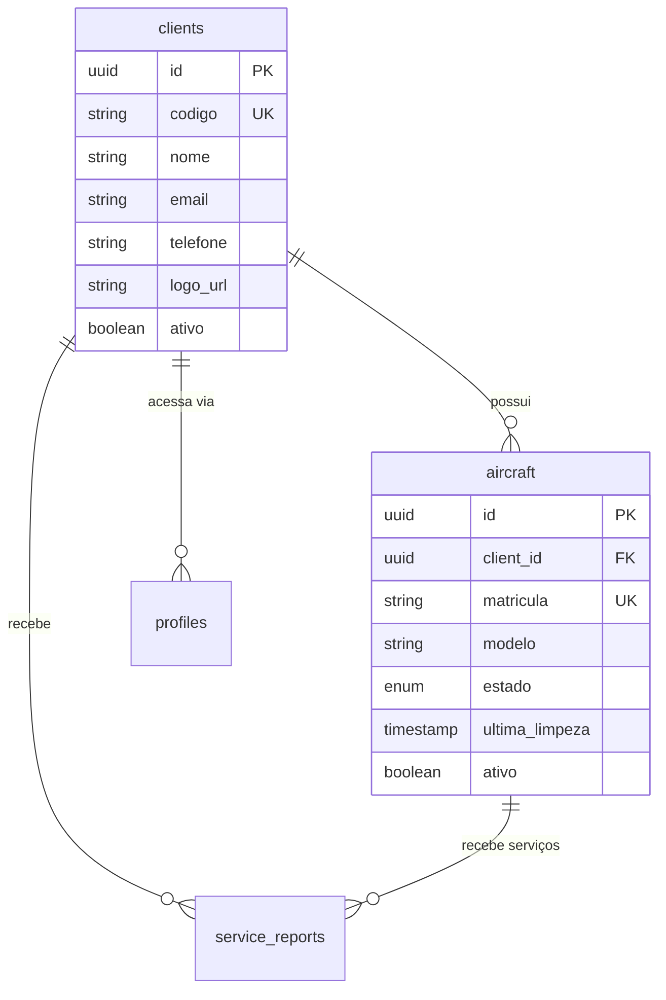

# Módulo Clientes e Aeronaves - AirPlus AAMS

## Visão Geral

Este módulo gerencia o cadastro de clientes externos da AirPlus e suas respectivas aeronaves. É fundamental para:

- **Multi-tenancy**: Isolamento de dados por cliente
- **Rastreamento**: Histórico de limpezas por aeronave
- **Relatórios**: Associação de serviços prestados
- **Dashboards**: Visualização personalizada por cliente

## Diagrama de Relacionamento



## Entidade: Clients

### Propósito
Representa empresas/organizações que contratam os serviços da AirPlus.

### Schema

```sql
CREATE TABLE clients (
  id UUID PRIMARY KEY DEFAULT gen_random_uuid(),
  codigo TEXT NOT NULL UNIQUE,
  nome TEXT NOT NULL,
  email TEXT,
  telefone TEXT,
  logo_url TEXT,
  ativo BOOLEAN DEFAULT true,
  created_by UUID REFERENCES auth.users(id),
  updated_by UUID REFERENCES auth.users(id),
  created_at TIMESTAMPTZ DEFAULT NOW(),
  updated_at TIMESTAMPTZ DEFAULT NOW()
);

-- Índices
CREATE UNIQUE INDEX idx_clients_codigo ON clients(codigo);
CREATE INDEX idx_clients_nome ON clients(nome);
CREATE INDEX idx_clients_ativo ON clients(ativo);

-- Trigger
CREATE TRIGGER update_clients_updated_at
  BEFORE UPDATE ON clients
  FOR EACH ROW
  EXECUTE FUNCTION update_updated_at_column();

-- Auditoria
CREATE TRIGGER audit_clients
  AFTER INSERT OR UPDATE OR DELETE ON clients
  FOR EACH ROW
  EXECUTE FUNCTION log_audit_event();
```

### TypeScript Interface

```typescript
interface Client {
  id: string;
  codigo: string;          // Ex: "TAAG", "SONAIR", "LAM"
  nome: string;            // Ex: "TAAG Angola Airlines"
  email?: string;          // Contato principal
  telefone?: string;       // Formato: +244 9XX XXX XXX
  logo_url?: string;       // URL do Supabase Storage
  ativo: boolean;
  created_by?: string;
  updated_by?: string;
  created_at: string;
  updated_at: string;
}

type ClientInsert = Omit<Client, 'id' | 'created_at' | 'updated_at'>;
type ClientUpdate = Partial<ClientInsert>;
```

### Validação (Zod)

```typescript
// src/lib/validations/client.ts
import { z } from 'zod';

export const clientSchema = z.object({
  codigo: z.string()
    .min(2, 'Código deve ter pelo menos 2 caracteres')
    .max(20, 'Código muito longo')
    .regex(/^[A-Z0-9_-]+$/, 'Apenas letras maiúsculas, números, hífen e underscore')
    .transform(val => val.toUpperCase()),
  
  nome: z.string()
    .min(3, 'Nome deve ter pelo menos 3 caracteres')
    .max(200, 'Nome muito longo'),
  
  email: z.string()
    .email('Email inválido')
    .optional()
    .or(z.literal('')),
  
  telefone: z.string()
    .regex(/^(\+244)?[9][1-9][0-9]{7}$/, 'Telefone angolano inválido')
    .optional()
    .or(z.literal('')),
  
  logo_url: z.string()
    .url('URL inválida')
    .optional()
    .or(z.literal('')),
  
  ativo: z.boolean()
    .default(true),
});

export type ClientFormValues = z.infer<typeof clientSchema>;
```

### RLS Policies

```sql
ALTER TABLE clients ENABLE ROW LEVEL SECURITY;

-- Policy 1: Todos autenticados podem visualizar clientes ativos
CREATE POLICY "Clients visible to all authenticated"
ON clients FOR SELECT
USING (ativo = true);

-- Policy 2: Apenas admins/gestores podem criar
CREATE POLICY "Only admins can insert clients"
ON clients FOR INSERT
WITH CHECK (is_admin_or_manager(auth.uid()));

-- Policy 3: Apenas admins/gestores podem atualizar
CREATE POLICY "Only admins can update clients"
ON clients FOR UPDATE
USING (is_admin_or_manager(auth.uid()));

-- Policy 4: Apenas admins podem deletar (soft delete)
CREATE POLICY "Only admins can delete clients"
ON clients FOR DELETE
USING (is_admin_or_manager(auth.uid()));
```

### API Hooks

```typescript
// src/hooks/queries/useClients.ts

export function useClients() {
  return useQuery({
    queryKey: ['clients'],
    queryFn: async () => {
      const { data, error } = await supabase
        .from('clients')
        .select('*')
        .eq('ativo', true)
        .order('nome');
      
      if (error) throw error;
      return data as Client[];
    },
  });
}

export function useClient(id: string) {
  return useQuery({
    queryKey: ['clients', id],
    queryFn: async () => {
      const { data, error } = await supabase
        .from('clients')
        .select('*, aircraft(*)')
        .eq('id', id)
        .single();
      
      if (error) throw error;
      return data;
    },
    enabled: !!id,
  });
}

export function useCreateClient() {
  const queryClient = useQueryClient();
  
  return useMutation({
    mutationFn: async (newClient: ClientInsert) => {
      const { data: session } = await supabase.auth.getSession();
      
      const { data, error } = await supabase
        .from('clients')
        .insert({
          ...newClient,
          created_by: session?.session?.user.id,
        })
        .select()
        .single();
      
      if (error) throw error;
      return data as Client;
    },
    onSuccess: () => {
      queryClient.invalidateQueries({ queryKey: ['clients'] });
      toast.success('Cliente criado com sucesso!');
    },
    onError: (error: any) => {
      if (error.code === '23505') {
        toast.error('Código do cliente já existe!');
      } else {
        toast.error(`Erro: ${error.message}`);
      }
    },
  });
}

export function useUpdateClient() {
  const queryClient = useQueryClient();
  
  return useMutation({
    mutationFn: async ({ id, updates }: { id: string; updates: ClientUpdate }) => {
      const { data: session } = await supabase.auth.getSession();
      
      const { data, error } = await supabase
        .from('clients')
        .update({
          ...updates,
          updated_by: session?.session?.user.id,
        })
        .eq('id', id)
        .select()
        .single();
      
      if (error) throw error;
      return data as Client;
    },
    onSuccess: () => {
      queryClient.invalidateQueries({ queryKey: ['clients'] });
      toast.success('Cliente atualizado!');
    },
  });
}

export function useDeleteClient() {
  const queryClient = useQueryClient();
  
  return useMutation({
    mutationFn: async (id: string) => {
      // Soft delete
      const { error } = await supabase
        .from('clients')
        .update({ ativo: false })
        .eq('id', id);
      
      if (error) throw error;
    },
    onSuccess: () => {
      queryClient.invalidateQueries({ queryKey: ['clients'] });
      toast.success('Cliente desativado!');
    },
  });
}
```

---

## Entidade: Aircraft

### Propósito
Representa aeronaves pertencentes aos clientes, sujeitas aos serviços da AirPlus.

### Schema

```sql
-- Enum para estado da aeronave
CREATE TYPE aircraft_status AS ENUM ('ativo', 'manutencao', 'inativo');

CREATE TABLE aircraft (
  id UUID PRIMARY KEY DEFAULT gen_random_uuid(),
  client_id UUID NOT NULL REFERENCES clients(id) ON DELETE CASCADE,
  matricula TEXT NOT NULL UNIQUE,
  modelo TEXT NOT NULL,
  estado aircraft_status DEFAULT 'ativo',
  ultima_limpeza TIMESTAMPTZ,
  ativo BOOLEAN DEFAULT true,
  created_by UUID REFERENCES auth.users(id),
  updated_by UUID REFERENCES auth.users(id),
  created_at TIMESTAMPTZ DEFAULT NOW(),
  updated_at TIMESTAMPTZ DEFAULT NOW()
);

-- Índices
CREATE UNIQUE INDEX idx_aircraft_matricula ON aircraft(matricula);
CREATE INDEX idx_aircraft_client ON aircraft(client_id);
CREATE INDEX idx_aircraft_estado ON aircraft(estado);
CREATE INDEX idx_aircraft_ultima_limpeza ON aircraft(ultima_limpeza DESC);

-- Triggers
CREATE TRIGGER update_aircraft_updated_at
  BEFORE UPDATE ON aircraft
  FOR EACH ROW
  EXECUTE FUNCTION update_updated_at_column();

CREATE TRIGGER audit_aircraft
  AFTER INSERT OR UPDATE OR DELETE ON aircraft
  FOR EACH ROW
  EXECUTE FUNCTION log_audit_event();
```

### TypeScript Interface

```typescript
type AircraftStatus = 'ativo' | 'manutencao' | 'inativo';

interface Aircraft {
  id: string;
  client_id: string;
  matricula: string;        // Ex: "D2-TED", "C9-BAA"
  modelo: string;           // Ex: "Boeing 777-300ER", "Embraer E190"
  estado: AircraftStatus;
  ultima_limpeza?: string;  // ISO timestamp
  ativo: boolean;
  created_by?: string;
  updated_by?: string;
  created_at: string;
  updated_at: string;
  
  // Relations (quando expanded)
  client?: Client;
  service_reports?: ServiceReport[];
}

type AircraftInsert = Omit<Aircraft, 'id' | 'created_at' | 'updated_at' | 'client' | 'service_reports'>;
type AircraftUpdate = Partial<AircraftInsert>;
```

### Validação (Zod)

```typescript
// src/lib/validations/aircraft.ts
import { z } from 'zod';

export const aircraftSchema = z.object({
  matricula: z.string()
    .min(3, 'Matrícula deve ter pelo menos 3 caracteres')
    .max(20, 'Matrícula muito longa')
    .regex(/^[A-Z0-9-]+$/, 'Apenas letras maiúsculas, números e hífen')
    .transform(val => val.toUpperCase()),
  
  modelo: z.string()
    .min(2, 'Modelo obrigatório')
    .max(100, 'Modelo muito longo'),
  
  client_id: z.string()
    .uuid('Cliente inválido'),
  
  estado: z.enum(['ativo', 'manutencao', 'inativo'])
    .default('ativo'),
  
  ativo: z.boolean()
    .default(true),
});

export type AircraftFormValues = z.infer<typeof aircraftSchema>;
```

### RLS Policies

```sql
ALTER TABLE aircraft ENABLE ROW LEVEL SECURITY;

-- Policy 1: AirPlus staff vê tudo
CREATE POLICY "Aircraft visible to AirPlus staff"
ON aircraft FOR SELECT
USING (
  is_admin_or_manager(auth.uid()) OR
  has_role(auth.uid(), 'supervisor'::user_role) OR
  has_role(auth.uid(), 'tecnico'::user_role)
);

-- Policy 2: Clientes veem apenas suas aeronaves
CREATE POLICY "Aircraft visible to owner client"
ON aircraft FOR SELECT
USING (
  EXISTS (
    SELECT 1 FROM profiles p
    WHERE p.id = auth.uid()
    AND p.client_id = aircraft.client_id
  )
);

-- Policy 3: Apenas admins/gestores podem criar
CREATE POLICY "Only admins/managers can create aircraft"
ON aircraft FOR INSERT
WITH CHECK (is_admin_or_manager(auth.uid()));

-- Policy 4: Apenas admins/gestores podem atualizar
CREATE POLICY "Only admins/managers can update aircraft"
ON aircraft FOR UPDATE
USING (is_admin_or_manager(auth.uid()));

-- Policy 5: Apenas super_admin pode deletar
CREATE POLICY "Only admins can delete aircraft"
ON aircraft FOR DELETE
USING (has_role(auth.uid(), 'super_admin'::user_role));
```

### Trigger: Atualizar ultima_limpeza

```sql
-- Atualizar ultima_limpeza quando relatório for publicado
CREATE OR REPLACE FUNCTION update_aircraft_last_cleaning()
RETURNS TRIGGER
LANGUAGE plpgsql
SECURITY DEFINER
SET search_path = public
AS $$
BEGIN
  IF NEW.status = 'publicado' AND (OLD.status IS NULL OR OLD.status != 'publicado') THEN
    UPDATE aircraft
    SET ultima_limpeza = NEW.service_date
    WHERE id = NEW.aircraft_id
    AND (ultima_limpeza IS NULL OR NEW.service_date > ultima_limpeza);
  END IF;
  
  RETURN NEW;
END;
$$;

CREATE TRIGGER trigger_update_aircraft_last_cleaning
  AFTER INSERT OR UPDATE ON service_reports
  FOR EACH ROW
  EXECUTE FUNCTION update_aircraft_last_cleaning();
```

### API Hooks

```typescript
// src/hooks/queries/useAircraft.ts

export function useAircraftList(clientId?: string) {
  return useQuery({
    queryKey: ['aircraft', clientId],
    queryFn: async () => {
      let query = supabase
        .from('aircraft')
        .select('*, client:clients(*)')
        .eq('ativo', true)
        .order('matricula');
      
      if (clientId) {
        query = query.eq('client_id', clientId);
      }
      
      const { data, error } = await query;
      
      if (error) throw error;
      return data as (Aircraft & { client: Client })[];
    },
  });
}

export function useAircraft(id: string) {
  return useQuery({
    queryKey: ['aircraft', id],
    queryFn: async () => {
      const { data, error } = await supabase
        .from('aircraft')
        .select('*, client:clients(*), service_reports(count)')
        .eq('id', id)
        .single();
      
      if (error) throw error;
      return data;
    },
    enabled: !!id,
  });
}

export function useCreateAircraft() {
  const queryClient = useQueryClient();
  
  return useMutation({
    mutationFn: async (newAircraft: AircraftInsert) => {
      const { data: session } = await supabase.auth.getSession();
      
      const { data, error } = await supabase
        .from('aircraft')
        .insert({
          ...newAircraft,
          created_by: session?.session?.user.id,
        })
        .select('*, client:clients(*)')
        .single();
      
      if (error) throw error;
      return data;
    },
    onSuccess: () => {
      queryClient.invalidateQueries({ queryKey: ['aircraft'] });
      toast.success('Aeronave cadastrada!');
    },
    onError: (error: any) => {
      if (error.code === '23505') {
        toast.error('Matrícula já cadastrada!');
      } else {
        toast.error(`Erro: ${error.message}`);
      }
    },
  });
}

export function useUpdateAircraft() {
  const queryClient = useQueryClient();
  
  return useMutation({
    mutationFn: async ({ id, updates }: { id: string; updates: AircraftUpdate }) => {
      const { data: session } = await supabase.auth.getSession();
      
      const { data, error } = await supabase
        .from('aircraft')
        .update({
          ...updates,
          updated_by: session?.session?.user.id,
        })
        .eq('id', id)
        .select('*, client:clients(*)')
        .single();
      
      if (error) throw error;
      return data;
    },
    onSuccess: () => {
      queryClient.invalidateQueries({ queryKey: ['aircraft'] });
      toast.success('Aeronave atualizada!');
    },
  });
}

export function useDeleteAircraft() {
  const queryClient = useQueryClient();
  
  return useMutation({
    mutationFn: async (id: string) => {
      // Soft delete
      const { error } = await supabase
        .from('aircraft')
        .update({ ativo: false })
        .eq('id', id);
      
      if (error) throw error;
    },
    onSuccess: () => {
      queryClient.invalidateQueries({ queryKey: ['aircraft'] });
      toast.success('Aeronave desativada!');
    },
  });
}
```

## Componentes UI

### ClientForm Component

```typescript
// src/components/clients/ClientForm.tsx
import { useForm } from 'react-hook-form';
import { zodResolver } from '@hookform/resolvers/zod';
import { clientSchema, type ClientFormValues } from '@/lib/validations/client';
import { useCreateClient, useUpdateClient } from '@/hooks/queries/useClients';

interface ClientFormProps {
  client?: Client;
  onSuccess?: () => void;
}

export function ClientForm({ client, onSuccess }: ClientFormProps) {
  const createMutation = useCreateClient();
  const updateMutation = useUpdateClient();
  
  const form = useForm<ClientFormValues>({
    resolver: zodResolver(clientSchema),
    defaultValues: client || {
      ativo: true,
    },
  });
  
  const onSubmit = async (values: ClientFormValues) => {
    if (client) {
      await updateMutation.mutateAsync({ id: client.id, updates: values });
    } else {
      await createMutation.mutateAsync(values as ClientInsert);
    }
    
    onSuccess?.();
  };
  
  return (
    <Form {...form}>
      <form onSubmit={form.handleSubmit(onSubmit)} className="space-y-4">
        <div className="grid grid-cols-2 gap-4">
          <FormField
            control={form.control}
            name="codigo"
            render={({ field }) => (
              <FormItem>
                <FormLabel>Código *</FormLabel>
                <FormControl>
                  <Input {...field} placeholder="Ex: TAAG" />
                </FormControl>
                <FormMessage />
              </FormItem>
            )}
          />
          
          <FormField
            control={form.control}
            name="nome"
            render={({ field }) => (
              <FormItem>
                <FormLabel>Nome Completo *</FormLabel>
                <FormControl>
                  <Input {...field} placeholder="Ex: TAAG Angola Airlines" />
                </FormControl>
                <FormMessage />
              </FormItem>
            )}
          />
        </div>
        
        <div className="grid grid-cols-2 gap-4">
          <FormField
            control={form.control}
            name="email"
            render={({ field }) => (
              <FormItem>
                <FormLabel>Email</FormLabel>
                <FormControl>
                  <Input {...field} type="email" placeholder="contato@exemplo.ao" />
                </FormControl>
                <FormMessage />
              </FormItem>
            )}
          />
          
          <FormField
            control={form.control}
            name="telefone"
            render={({ field }) => (
              <FormItem>
                <FormLabel>Telefone</FormLabel>
                <FormControl>
                  <Input {...field} placeholder="+244 9XX XXX XXX" />
                </FormControl>
                <FormMessage />
              </FormItem>
            )}
          />
        </div>
        
        <FormField
          control={form.control}
          name="logo_url"
          render={({ field }) => (
            <FormItem>
              <FormLabel>URL do Logo</FormLabel>
              <FormControl>
                <Input {...field} placeholder="https://..." />
              </FormControl>
              <FormMessage />
            </FormItem>
          )}
        />
        
        <Button 
          type="submit" 
          disabled={createMutation.isPending || updateMutation.isPending}
        >
          {client ? 'Atualizar' : 'Criar'} Cliente
        </Button>
      </form>
    </Form>
  );
}
```

### AircraftForm Component

```typescript
// src/components/aircraft/AircraftForm.tsx
import { useForm } from 'react-hook-form';
import { zodResolver } from '@hookform/resolvers/zod';
import { aircraftSchema, type AircraftFormValues } from '@/lib/validations/aircraft';
import { useClients } from '@/hooks/queries/useClients';
import { useCreateAircraft, useUpdateAircraft } from '@/hooks/queries/useAircraft';

interface AircraftFormProps {
  aircraft?: Aircraft;
  onSuccess?: () => void;
}

export function AircraftForm({ aircraft, onSuccess }: AircraftFormProps) {
  const { data: clients } = useClients();
  const createMutation = useCreateAircraft();
  const updateMutation = useUpdateAircraft();
  
  const form = useForm<AircraftFormValues>({
    resolver: zodResolver(aircraftSchema),
    defaultValues: aircraft || {
      estado: 'ativo',
      ativo: true,
    },
  });
  
  const onSubmit = async (values: AircraftFormValues) => {
    if (aircraft) {
      await updateMutation.mutateAsync({ id: aircraft.id, updates: values });
    } else {
      await createMutation.mutateAsync(values as AircraftInsert);
    }
    
    onSuccess?.();
  };
  
  return (
    <Form {...form}>
      <form onSubmit={form.handleSubmit(onSubmit)} className="space-y-4">
        <FormField
          control={form.control}
          name="client_id"
          render={({ field }) => (
            <FormItem>
              <FormLabel>Cliente *</FormLabel>
              <Select onValueChange={field.onChange} defaultValue={field.value}>
                <FormControl>
                  <SelectTrigger>
                    <SelectValue placeholder="Selecione o cliente" />
                  </SelectTrigger>
                </FormControl>
                <SelectContent>
                  {clients?.map(client => (
                    <SelectItem key={client.id} value={client.id}>
                      {client.nome}
                    </SelectItem>
                  ))}
                </SelectContent>
              </Select>
              <FormMessage />
            </FormItem>
          )}
        />
        
        <div className="grid grid-cols-2 gap-4">
          <FormField
            control={form.control}
            name="matricula"
            render={({ field }) => (
              <FormItem>
                <FormLabel>Matrícula *</FormLabel>
                <FormControl>
                  <Input {...field} placeholder="Ex: D2-TED" />
                </FormControl>
                <FormMessage />
              </FormItem>
            )}
          />
          
          <FormField
            control={form.control}
            name="modelo"
            render={({ field }) => (
              <FormItem>
                <FormLabel>Modelo *</FormLabel>
                <FormControl>
                  <Input {...field} placeholder="Ex: Boeing 777-300ER" />
                </FormControl>
                <FormMessage />
              </FormItem>
            )}
          />
        </div>
        
        <FormField
          control={form.control}
          name="estado"
          render={({ field }) => (
            <FormItem>
              <FormLabel>Estado</FormLabel>
              <Select onValueChange={field.onChange} defaultValue={field.value}>
                <FormControl>
                  <SelectTrigger>
                    <SelectValue />
                  </SelectTrigger>
                </FormControl>
                <SelectContent>
                  <SelectItem value="ativo">Ativo</SelectItem>
                  <SelectItem value="manutencao">Manutenção</SelectItem>
                  <SelectItem value="inativo">Inativo</SelectItem>
                </SelectContent>
              </Select>
              <FormMessage />
            </FormItem>
          )}
        />
        
        <Button 
          type="submit" 
          disabled={createMutation.isPending || updateMutation.isPending}
        >
          {aircraft ? 'Atualizar' : 'Cadastrar'} Aeronave
        </Button>
      </form>
    </Form>
  );
}
```

## Regras de Negócio

1. **Unicidade de Código e Matrícula**
   - `clients.codigo` deve ser único em toda a base
   - `aircraft.matricula` deve ser única em toda a base

2. **Soft Delete Obrigatório**
   - Clientes e aeronaves nunca são deletados fisicamente
   - Campo `ativo = false` para desativação
   - Registros inativos permanecem em relatórios antigos

3. **Cascata de Exclusão**
   - Se um cliente for deletado, suas aeronaves também são (via `ON DELETE CASCADE`)
   - **ATENÇÃO**: Isso só acontece em deleção física (não recomendado)

4. **Atualização Automática**
   - Campo `ultima_limpeza` é atualizado automaticamente via trigger quando relatório é publicado

5. **Permissões Hierárquicas**
   - **AirPlus staff** (admin/gestor/supervisor/técnico): Acesso total
   - **Clientes**: Apenas suas próprias aeronaves (RLS)

6. **Auditoria Completa**
   - Todas as operações geram logs em `audit_logs`
   - Campos `created_by` e `updated_by` rastreiam autoria

---

**Última Atualização**: 2025-10-22  
**Responsável**: Equipe AirPlus TI  
**Versão do Documento**: 1.0
